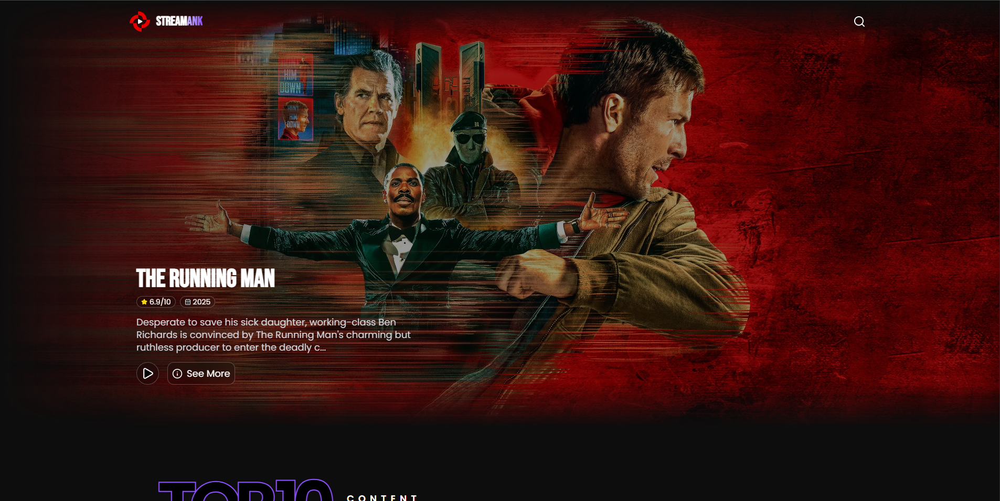

# 🎬AnkStream

Aplicación web de streaming ficticia desarrollada con **React** que consume la **API de TMDB**.  
El proyecto simula una plataforma de streaming moderna, con secciones de contenido en tendencia, búsqueda de películas y vistas de detalle, enfocándose en una buena experiencia de usuario y una arquitectura clara.

---

## 🚀 Objetivo del proyecto

El propósito de este proyecto fue profundizar en el **consumo de APIs externas** y reforzar conceptos clave del desarrollo frontend moderno, enfocándome en:

- Consumo y manejo de datos desde la API de TMDB
- Navegación con rutas dinámicas usando React Router
- Manejo de estados de carga y experiencia de usuario
- Construcción de una interfaz responsive con TailwindCSS

---

## 🛠️ Tecnologías utilizadas

- [Astro](https://astro.build/) – Framework de sitios estáticos.
- [GSAP](https://greensock.com/gsap/) – Librería de animaciones.
- [TailwindCSS](https://tailwindcss.com/) – Framework CSS utilitario.

- [React 19](https://es.react.dev/) – Biblioteca para la construcción de interfaces de usuario
- [TypeScript](https://www.typescriptlang.org/) – Tipado estático para mayor robustez del código
- [React Router](https://reactrouter.com/) – Manejo de rutas y navegación
- [TailwindCSS](https://tailwindcss.com/) – Estilos y diseño responsive
- [TMDB API](https://www.themoviedb.org/) – Fuente de datos de películas
- [Vite](https://vite.dev/)– Herramienta de desarrollo y build

---

## 📚 Lo que aprendí

- Consumo de APIs externas y manejo de datos asincrónicos en React
- Organización de componentes en una aplicación de mayor escala
- Implementación de rutas dinámicas y vistas de detalle
- Manejo de estados de carga mediante animaciones personalizadas
- Mejora de la experiencia de usuario en aplicaciones basadas en datos

---

## 🧩 Retos encontrados

- Coordinar múltiples peticiones a la API de TMDB
- Manejar correctamente los estados de carga sin afectar la percepción de rendimiento
- Mantener una estructura de código clara a medida que la aplicación crecía

---

## 🔗 Demo

El proyecto está desplegado en **Netlify**:  
👉 [Ver demo en línea](https://streamanks.netlify.app/)

---

## 🖼️ Screenshots

<!-- Agrega tus capturas de pantalla aquí -->

---

## 📌 Próximos pasos

- Implementar **skeleton loaders** para mejorar la percepción de carga
- Añadir manejo de errores más detallado para las peticiones a la API
- Guardar películas favoritas usando `localStorage`

---

## 🙌 Autor

Desarrollado por **Frank**  
Frontend Developer
